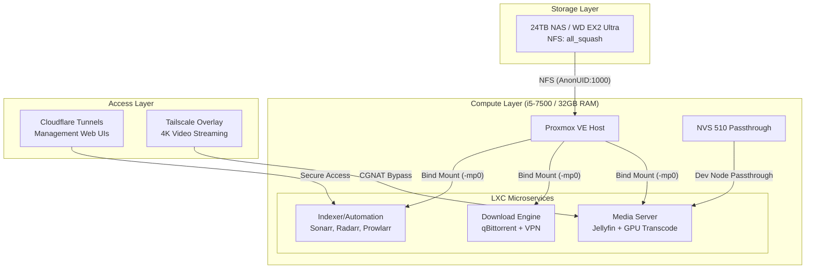

# 🎬 ArrSuite-Guide: The Infinite Homelab Wiki


Welcome to the **ArrSuite-Guide**. This is a comprehensive, DevOps-engineered blueprint for building a "Netflix-Killer" media stack using **Proxmox LXC containers** (Zero-Overhead) instead of bulky Docker VMs.

---

## 🧭 Project Navigation
This repository is structured as a generalized wiki. Start here to find what you need.

| Category | Documentation / Script | Description |
| :--- | :--- | :--- |
| **Main Guides** | 📖 [Complete Setup Guide](./ARR_STACK_SETUP.md) | Step-by-step installation from scratch. |
| | 🏗️ [Architecture Deep Dive](./ARCHITECTURE.md) | The "Why" behind LXC vs Docker & Storage logic. |
| | 🔐 [VPN & Split Tunneling](./VPN_SPLIT_TUNNEL_SETUP.md) | Secure routing for indexers and downloads. |
| **Automation** | 🚀 [Master Deploy Script](./arr-stack-deploy.sh) | One-click stack deployment for all containers. |
| | 🗄️ [NFS Interactive Setup](./nfs-setup.sh) | Configure your NAS mount on the PVE host. |
| | 🔧 [Container Storage Helper](./ct-add-storage.sh) | Quickly bind-mount storage to any LXC. |
| | 🛡️ [NFS Watchdog](./nfs-watchdog.sh) | Self-healing script for stale NFS handles. |
| | 🧹 [PVE Cleaner](./pve-cleaner.sh) | Reclaim SSD space on your Proxmox host. |
| **References** | ✅ [Setup Checklist](./example-configs/quick-setup-checklist.md) | Don't miss a single configuration step. |
| | 📂 [Path Schema](./example-configs/sonarr-radarr-paths.md) | The "Atomic Move" compliant path structure. |
| | 📟 [Container CLI Guide](./example-configs/container-management.md) | Essential Proxmox `pct` commands. |

---

## 🏗️ Visual Architecture



---

## 🛠️ The "Secret Sauce" (Core Cheatsheets)

### 1. The LXC Permission Fix (`all_squash`)
To solve permission issues in **Unprivileged Containers**, don't mess with complex UID mapping. Use `all_squash` on your NAS NFS export settings.

*   **NAS Settings (`/etc/exports`):**
    ```bash
    /mnt/HD/HD_a2/Media *(rw,all_squash,anonuid=1000,anongid=1000)
    ```
*   **PVE Host Bind Mount:**
    ```bash
    # Mount the host path to the container's path
    pct set <vmid> -mp0 /mnt/pve/media,mp=/mnt/media
    ```

### 2. Hardware Transcoding (NVIDIA NVS 510)
Pass the GPU nodes directly to the LXC container. No VM PCI passthrough needed!

*   **LXC Config (`/etc/pve/lxc/XXX.conf`):**
    ```bash
    lxc.cgroup2.devices.allow: c 195:* rwm
    lxc.cgroup2.devices.allow: c 509:* rwm
    lxc.mount.entry: /dev/nvidia0 dev/nvidia0 none bind,optional,create=file
    lxc.mount.entry: /dev/nvidiactl dev/nvidiactl none bind,optional,create=file
    lxc.mount.entry: /dev/nvidia-uvm dev/nvidia-uvm none bind,optional,create=file
    ```

### 3. Ultimate CLI Cheat Sheet
| Command | Action |
| :--- | :--- |
| `pct list` | List all containers and their status. |
| `pct enter <ID>` | Drop into the shell of a container. |
| `pct exec <ID> -- apt update` | Run a command inside a container without entering. |
| `vzdump <ID> --mode snapshot` | Create an instant backup before updating an app. |
| `journalctl -u sonarr -f` | Watch live logs for a specific service (inside LXC). |

---

## 📦 Automation Scripts Vault

### 🚀 [arr-stack-deploy.sh](./arr-stack-deploy.sh)
The one-click solution. This script executes multiple community-sourced LXC install scripts in sequence, setting up your entire infrastructure in under 10 minutes.

### 🛡️ [nfs-watchdog.sh](./nfs-watchdog.sh)
NFS mounts on Proxmox can become "stale" if the NAS reboots or network drops.
1. Save to `/usr/local/bin/nfs-watchdog.sh`.
2. Add to crontab: `* * * * * /usr/local/bin/nfs-watchdog.sh`.
It checks for staleness and forces a remount automatically.

### 🗄️ [nfs-setup.sh](./nfs-setup.sh) & [ct-add-storage.sh](./ct-add-storage.sh)
A two-step storage workflow:
1. `nfs-setup.sh`: Interactive script to mount your NAS to the PVE host.
2. `ct-add-storage.sh`: Adds the bind mount to your containers so they can see the media.

---

## 🌐 Networking & Access Strategy
*   **Cloudflare Tunnels**: Best for **Management** (Sonarr, Radarr, Overseerr). It provides a secure domain without opening ports.
*   **Tailscale**: Best for **Streaming** (Jellyfin). Since Cloudflare ToS forbids high-bandwidth video, Tailscale creates a private mesh network that bypasses CGNAT and works on any device.

---

## ❓ FAQ

**Q: Why LXC instead of Docker in a VM?**
A: **Efficiency.** A VM requires its own kernel and reserved RAM. LXC shares the host kernel, using only ~100MB RAM per container. It also allows native Proxmox backups and snapshots.

**Q: Is it hard to manage multiple containers?**
A: Not with the [Container CLI Guide](./example-configs/container-management.md). Proxmox's GUI also makes it easy to monitor everything in one place.

**Q: How do I update the apps?**
A: Most *arr apps update themselves via their own internal UI. For OS updates, run `apt update` inside the LXC or use our mass-update command in the cheatsheet.

---

*Found this useful? Star the repo and join the self-hosting revolution!*
