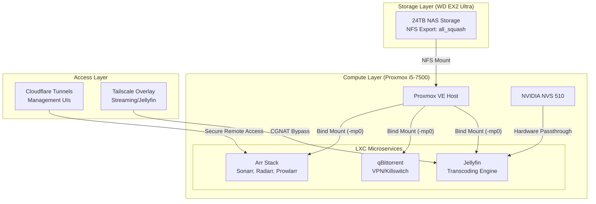

# 🎬 ArrSuite-Guide: The Infinite Homelab


Stop paying for 5+ streaming services. This repository is a battle-tested guide to building a **"Netflix-Killer"** homelab using Proxmox LXC containers. Optimized for an i5-7500 with 24TB of NAS storage, this setup prioritizes **Zero Overhead** and **Microservice Isolation**.

---

## 🚀 Introduction: "The Infinite Homelab"

Moving from paid cloud services to a self-hosted stack isn't just about saving money—it's about ownership. This guide moves away from the traditional "Monolithic Docker VM" approach. By using native Proxmox LXC containers, we achieve near-native performance, lightning-fast backups, and a "Blast Radius" isolation that ensures one broken update doesn't take down your entire library.

### Why this setup?
*   **Zero-Overhead:** No VM kernel bloat. Each service runs as a lightweight system process.
*   **Blast Radius Isolation:** Sonarr broke? Radarr and Jellyfin don't care.
*   **Hardware Acceleration:** NVS 510 GPU passthrough for seamless 4K transcoding.
*   **Storage Simplicity:** Bypassing UID/GID headaches with NFS `all_squash`.

---

## 🏗️ Architecture



---

## 🛠️ The "Cheatsheet" (Core Value)

### 1. Storage: The LXC Permission Fix
To solve the infamous LXC permission errors in unprivileged containers, use `all_squash` on your NAS NFS settings. This maps all incoming traffic to a single user.

**NAS `/etc/exports`:**
```bash
/mnt/HD/HD_a2/Media *(rw,all_squash,anonuid=1000,anongid=1000,no_subtree_check)
```

**PVE Host Bind Mount:**
```bash
# Pass the host mount to the container
pct set <vmid> -mp0 /mnt/pve/media,mp=/mnt/media
```

### 2. Graphics: NVS 510 GPU Passthrough
Add these lines to your LXC config file (`/etc/pve/lxc/XXX.conf`) to allow the Jellyfin container to access the NVIDIA NVS 510 for transcoding.

```bash
# NVIDIA Passthrough
lxc.cgroup2.devices.allow: c 195:* rwm
lxc.cgroup2.devices.allow: c 509:* rwm
lxc.mount.entry: /dev/nvidia0 dev/nvidia0 none bind,optional,create=file
lxc.mount.entry: /dev/nvidiactl dev/nvidiactl none bind,optional,create=file
lxc.mount.entry: /dev/nvidia-uvm dev/nvidia-uvm none bind,optional,create=file
```

---

## 📦 Automated Scripts Vault

| Script | Purpose | Description |
| :--- | :--- | :--- |
| [`arr-stack-deploy.sh`](./arr-stack-deploy.sh) | **One-Click Deploy** | Deploys Prowlarr, Sonarr, Radarr, and Jellyfin in seconds. |
| [`nfs-watchdog.sh`](./nfs-watchdog.sh) | **Mount Health** | Cron job that detects stale NFS handles and force-remounts. |
| [`pve-cleaner.sh`](./pve-cleaner.sh) | **Host Maintenance** | Safely clears journal logs and orphan images to reclaim SSD space. |

---

## 🌐 Networking

*   **Management (Radarr/Sonarr):** Exposed via **Cloudflare Tunnels**. This provides secure, SSL-encrypted access without opening a single port on your router.
*   **Streaming (Jellyfin):** Tunneled via **Tailscale**. This bypasses CGNAT and avoids Cloudflare ToS violations regarding video bandwidth, ensuring your account stays safe.

---

## ❓ FAQ

**Q: Why LXC and not Docker?**
Lower overhead, better isolation, and independent kernel scheduling. Each LXC container is a first-class citizen in Proxmox, making backups and resource monitoring native and effortless.

**Q: Is this safe?**
Yes. We use unprivileged containers by default. Even if a service is compromised, the attacker is "trapped" in a container with no root access to the host or the rest of the network.

---

## ⭐ Credits & Resources
*   [Proxmox VE Helper Scripts](https://github.com/community-scripts/ProxmoxVE)
*   [TRaSH Guides](https://trash-guides.info/)
*   [Servarr Wiki](https://wiki.servarr.com/)

---

*Found this useful? Give it a ⭐ to help others kill their Netflix subscription!*
