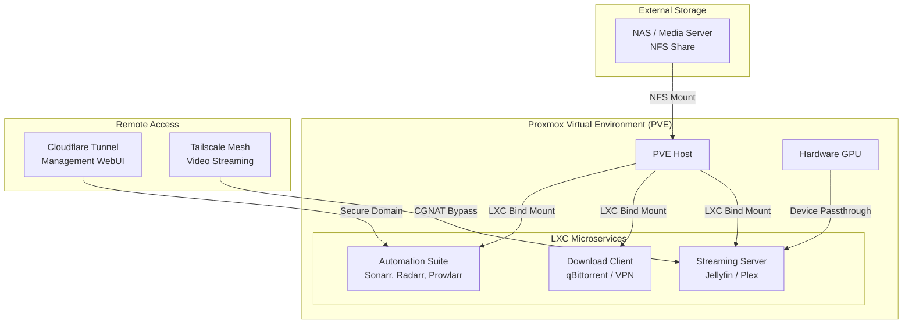

# 🎬 ArrSuite-Guide: The Ultimate Media Homelab Wiki


Welcome to the **ArrSuite-Guide Wiki**. This project provides a production-grade blueprint for building a high-performance, automated media empire using **Proxmox LXC containers**. By utilizing system-level virtualization (LXC) instead of hardware-level VMs, we achieve a "Zero-Overhead" environment that is easier to back up, faster to deploy, and more resource-efficient.

---

## 🗺️ Step-by-Step Deployment Roadmap

Follow these steps in order to build your stack from the ground up.

### 🏁 Level 1: Foundation
1.  **[Architecture Deep Dive](./ARCHITECTURE.md)**: Understand the logic of LXC vs. Docker and why we use unprivileged containers.
2.  **[NAS & Storage Setup](./nfs-setup.sh)**: Use this interactive script to mount your network storage (NFS) to the Proxmox host.
3.  **[Path Schema Reference](./example-configs/sonarr-radarr-paths.md)**: Set up your folders correctly to enable "Atomic Moves" (instant file transfers).

### 🚀 Level 2: Deployment
4.  **[Master Stack Deploy](./arr-stack-deploy.sh)**: Run the one-click installer to spin up the entire Arr Suite in isolated containers.
5.  **[Storage Mounting Helper](./ct-add-storage.sh)**: Use this script to bridge the host's media storage into each new container.
6.  **[The Setup Checklist](./example-configs/quick-setup-checklist.md)**: A line-by-line guide to configuring the web UIs for the first time.

### 🔐 Level 3: Security & Networking
7.  **[VPN & Split Tunneling](./VPN_SPLIT_TUNNEL_SETUP.md)**: Route your download traffic through a VPN while keeping your management UI local.
8.  **[Remote Access Guide](./VPN_GETTING_STARTED.md)**: Set up Cloudflare Tunnels (for management) and Tailscale (for 4K streaming).

### 🛠️ Level 4: Maintenance
9.  **[Host Health & Cleanup](./pve-cleaner.sh)**: Automate the removal of old logs and orphan images.
10. **[NFS Watchdog](./nfs-watchdog.sh)**: A self-healing cron job to ensure your NAS mounts never stay "stale."

---

## 🏗️ Technical Architecture



---

## 🛠️ Essential CLI Cheatsheet

| Task | Command |
| :--- | :--- |
| **List Containers** | `pct list` |
| **Enter Container** | `pct enter <VMID>` |
| **Stop/Start** | `pct stop <VMID>` \| `pct start <VMID>` |
| **Mass Update** | `pct exec <VMID> -- apt update && apt upgrade -y` |
| **Instant Backup** | `vzdump <VMID> --mode snapshot --storage local` |
| **Check Mounts** | `df -h` |

---

## ⚙️ Automation Scripts Guide

These scripts are designed for the **Proxmox (Debian) Shell**. Use these one-liners to fetch and execute directly without manually managing file permissions.

### 🚀 One-Line Deployment & Setup
| Task | Description | One-Liner (Copy-Paste to PVE Host) |
| :--- | :--- | :--- |
| **Deploy Full Stack** | Auto-installs Prowlarr, Sonarr, Radarr, Jellyfin. | `bash -c "$(wget -qLO - https://raw.githubusercontent.com/AmmarTee/ArrSuite-Guide/main/arr-stack-deploy.sh)"` |
| **Setup NFS/NAS** | Interactive script to mount your storage. | `bash -c "$(wget -qLO - https://raw.githubusercontent.com/AmmarTee/ArrSuite-Guide/main/nfs-setup.sh)"` |
| **Add Storage to CT**| Bind mount host storage to a specific LXC. | `wget https://raw.githubusercontent.com/AmmarTee/ArrSuite-Guide/main/ct-add-storage.sh -O /usr/local/bin/ct-add-storage && chmod +x /usr/local/bin/ct-add-storage` |
| **System Cleanup** | Reclaim space and vacuum system logs. | `bash -c "$(wget -qLO - https://raw.githubusercontent.com/AmmarTee/ArrSuite-Guide/main/pve-cleaner.sh)"` |

### 🛡️ Persistence & Reliability
To prevent "Stale File Handle" errors, install the watchdog into your system crontab:

```bash
# 1. Install the script
wget -qLO /usr/local/bin/nfs-watchdog.sh https://raw.githubusercontent.com/AmmarTee/ArrSuite-Guide/main/nfs-watchdog.sh
chmod +x /usr/local/bin/nfs-watchdog.sh

# 2. Add to crontab (Run every minute)
(crontab -l 2>/dev/null; echo "* * * * * /usr/local/bin/nfs-watchdog.sh") | crontab -
```

---

## ❓ Frequently Asked Questions

### 🌩️ General Logic
**Q: Why LXC and not Docker in a VM?**  
A: Efficiency and integration. A VM wastes 512MB-1GB of RAM just to boot its own kernel. LXC shares the Proxmox kernel, using only the RAM the app actually needs. Plus, you get native Proxmox backups for every single service individually.

**Q: What is a "Bind Mount"?**  
A: It’s a way to let an LXC container "see" a folder on the Proxmox host. Instead of the container having its own 10TB virtual disk, it simply looks through a "window" at the host's storage.

### 💾 Storage & Permissions
**Q: Why do I get "Permission Denied" in my containers?**  
A: Proxmox "Unprivileged" containers map user IDs to high numbers for security. The easiest fix is setting `all_squash` on your NAS NFS export, which forces all connections to use a specific ID (usually 1000).

**Q: Can I use Local Hard Drives instead of a NAS?**  
A: Absolutely. Just mount the drive to `/mnt/storage` on the Proxmox host and use the `ct-add-storage.sh` script provided in this repo.

### 🎥 Hardware & Performance
**Q: How do I enable Transcoding?**  
A: You must pass your GPU device nodes (e.g., `/dev/dri` or `/dev/nvidia*`) from the host to the LXC config file. See the [Hardware Guide](./ARCHITECTURE.md#phase-4-hardware--transcoding) for the specific lines to add.

**Q: Can multiple containers share the same GPU?**  
A: Yes! Unlike a VM which "claims" the hardware entirely, LXC allows multiple containers to share the same GPU device nodes simultaneously.

---

*Found this guide helpful? Give it a ⭐ on GitHub!*
